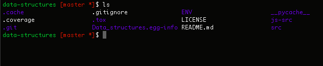

Tutorial
*********

Tutorial #1: Simple Project
==============

The most simple usage of write-me is using the ``genreadme`` command to make a README for a simple project that is not a web application. Tutorial #1 walks through using write-me in this scenario using an example project: a ``data-structures`` repository containing data structures written in python and javascript, as well as configuration data.

Installing write-me
-------------

The first step is to install the write-me PyPI package using pip. Once pip is installed, execute the following line:

``$ pip install write-me``

For further instructions regarding , see the "Installation" section of this documentation site. 

Tutorial #2: Web Framework
==============