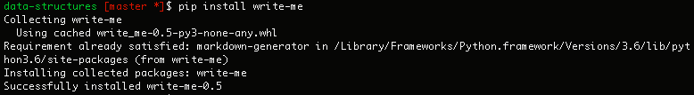
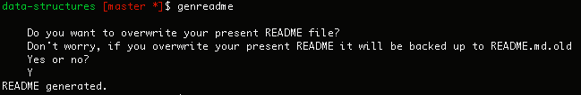
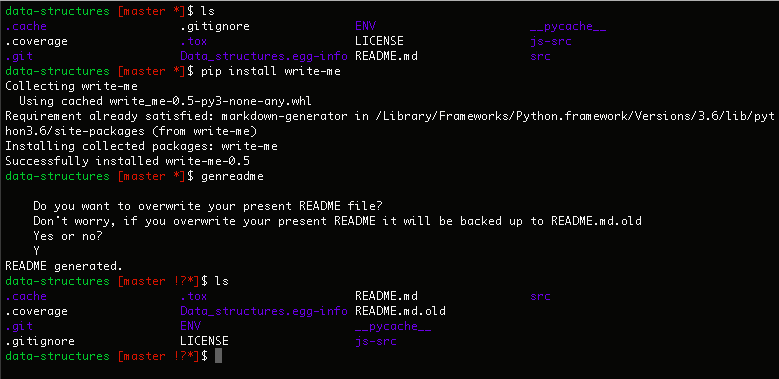
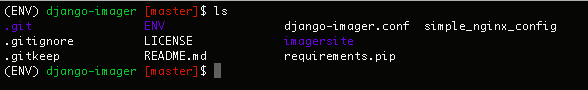
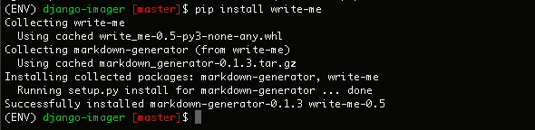
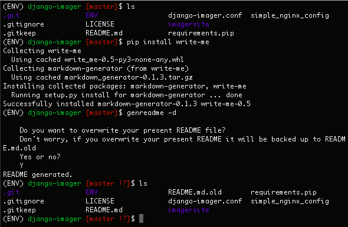

Tutorial
*********

Tutorial #1: Simple Project
=============================

The most simple usage of write-me is using the ``genreadme`` command to make a README for a simple project that is not a web application. Tutorial #1 walks through using write-me in this scenario using an example project: a ``data-structures`` repository containing data structures written in python and javascript, as well as configuration data.

Installing write-me
-------------------

The first step is to navigate to the root of the demo repository: the upmost level of ``data-structures``.

.. image:: tutorial_imgs/tutorial-1-step1.png
    :align: center
    :alt: Pip installation screenshot

The first step is to install the write-me PyPI package using pip. Once pip is installed, execute the following line:

``$ pip install write-me``

For further instructions regarding , see the "Installation" section of this documentation site. 

Using genreadme
-------------------

Now that write-me is installed successfully, execute the ``genreadme`` command. If the repo root already contains a README, the terminal window will prompt the user to confirm that the program can overwrite the old README, saving it as README.md.old.

Once the command has been successfully run, the terminal will display the following message, containing an indication of success and user TODOs — content necessary for a robust README that can not be gathered from the reposory data. 

README generation confirmation 
--------------------------------

The README has now been successfully created. On that same repo level, the user can now see their newly generated ``README.md``, as well as their old version in ``README.md.old``.

Tutorial #2: Web Framework
===========================

The slightly more advanced usage of write-me is using the same command, ``genreadme`` to make a README for a project that uses a web framework. The current version of write-me supports web framework implementation with Django, Pyramid, and Flask. Tutorial #2 walks through using write-me in this scenario using an example project: a ``django-imager`` repository containing a Django webapp used for hosting images.

Installing write-me
-------------------

The first step is to navigate to the root of the demo repository: the upmost level of ``django-imager``.

The first step is to install the write-me PyPI package using pip. In this example, it is being installed within a virtual environment called ENV. Once pip is installed, execute the following line:

``$ pip install write-me``

For further instructions regarding , see the "Installation" section of this documentation site. 

Using genreadme -d
-------------------

Now that write-me is installed successfully, execute the ``genreadme -d`` or ``genreadme --django`` command. (They are equivalent.) If you are using Pyramid or Flask instead of Django, just substitute ``-d`` for ``-p`` or ``-f``. If the repo root already contains a README, the terminal window will prompt the user to confirm that the program can overwrite the old README, saving it as README.md.old.

Once the command has been successfully run, the terminal will display the following message, containing an indication of success and user TODOs — content necessary for a robust README that can not be gathered from the reposory data. 

.. image:: tutorial_imgs/tutorial-2-step3.png
    :align: center
    :alt: Web framework write-me tutorial confirmation message

README generation confirmation 
--------------------------------

The README has now been successfully created. On that same repo level, the user can now see their newly generated ``README.md``, as well as their old version in ``README.md.old``.

